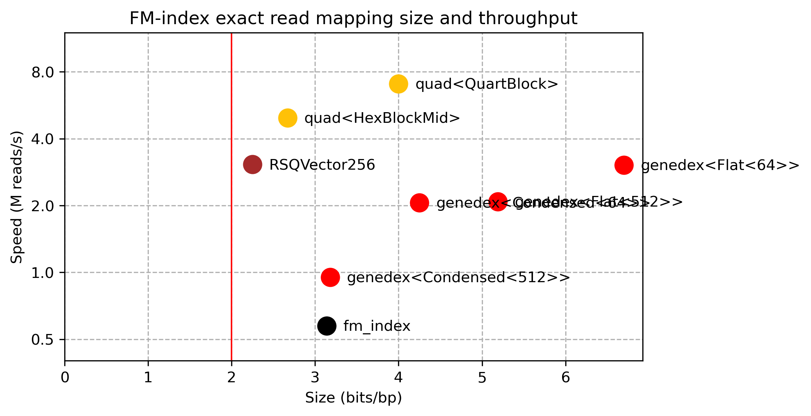

# QuadRank

This is a work-in-progress implementation of a fast data structure for /rank/
queries over a 2-bit DNA alphabet.

The main API looks like this:

``` rust
impl QuadRank {
    /// Take a DNA string over ACGT characters.
    pub fn new(seq: &[u8]) -> Self;
    
    /// Count the number of A, C, G, *and* T characters before the given position.
    pub fn count4(&self, pos: usize) -> [u32; 4];
}
```

## Small FM-index evaluation 
In `mapper/` there is a count-only FM-index implementation using `QuadRank`.

Here I'm mapping simulated 150bp short reads with 1% error rate against 550Mbp of
viral genomes. I first build each index (where I don't care about time/space
usage), and then count the number of matches of each fwd/rc read.
For `genedex` and `quad`, I query batches of 32 reads at a time.
All results are multithreaded (12 threads, on my 6-core i7-10750H) via `rayon::par_iter`.

- `Quad<>`: High-level rank structure: `src/ranker.rs`.
- `QuartBlock`: simple-but-large 512bit basic block for rank.
- `HexBlock`: small-but-intricate 512bit basic block that's a bit slower.
- `fm_index`: https://github.com/ajalab/fm-index
- `genedex`: https://github.com/feldroop/genedex, supports batching
- `RSQVector256`: Rank structure of https://github.com/rossanoventurini/qwt


