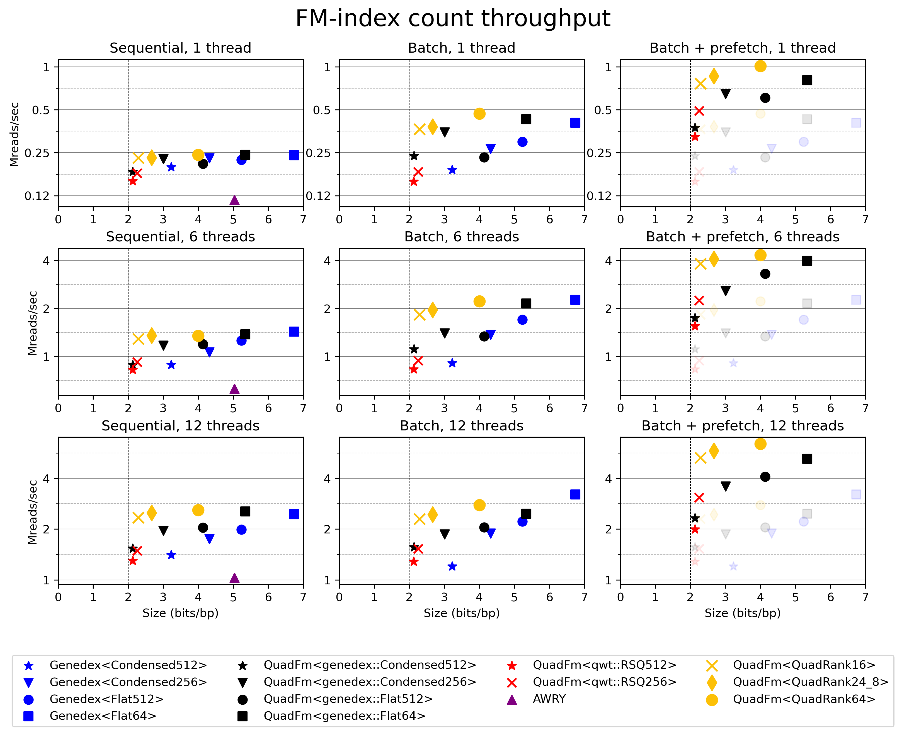

# QuadRank

This repo implements `BiRank`, `QuadRank`, and `QuadFm`, two fast rank data
structures and a simple count-only FM-index that all use batching and prefetching of queries.

BiRank and QuadRank need only a single cache-miss per query, making them
up to 2x faster than other methods in high-throughput settings.

QuadFm is up to 4x faster than genedex (https://github.com/feldroop/genedex),
which seems to be the fastest Rust-based FM-index currently.

**NOTE:** The code here is not really ready yet for consumption as a library:
- Only AVX2 is supported currently.
- The API still needs cleaning up.
- Docs still need to be written for docs.rs.

## BiRank

## QuadRank

## FM-index

Here I'm mapping simulated 150bp short reads with 1% error rate (see `examples/short_reads.rs`) against a 3.1 Gbp human genome.
I first build each index on the forward data (where I don't care about time/space usage),
and then count the number of matches of each fwd/rc read.
For `genedex` and `quad`, I query batches of 32 reads at a time.
I'm using 12 threads, on my 6-core i7-10750H, fixed at 3.0 GHz.

- `AWRY`: https://github.com/UM-Applied-Algorithms-Lab/AWRY
- `Genedex<>`: Genedex, with different choice of its rank structure.
- `QuadFm<>`: The FM-index in the `fm-index` directory here.
- `QuadRank*`: The rank structure we introduce.
- `qwt::RSQ{256,512}`: The rank structures of https://github.com/rossanoventurini/qwt.

## Benchmarks

This directory contains the `quadrank` crate implementing `BiRank` and
`QuadRank` and variants.
Synthetic benchmarks are run using `cargo run -r -F ext --example bench -- -j -b > evals/data.csv`.

The `fm-index` directory contains `QuadFm`. It is evaluated by running `cargo
run -r -- <human-genome>.fa <reads>.fa > ../evals/fm.csv`.

Plotting code can be found in `evals/plot.py` and `evals/plot-fm.py`.
